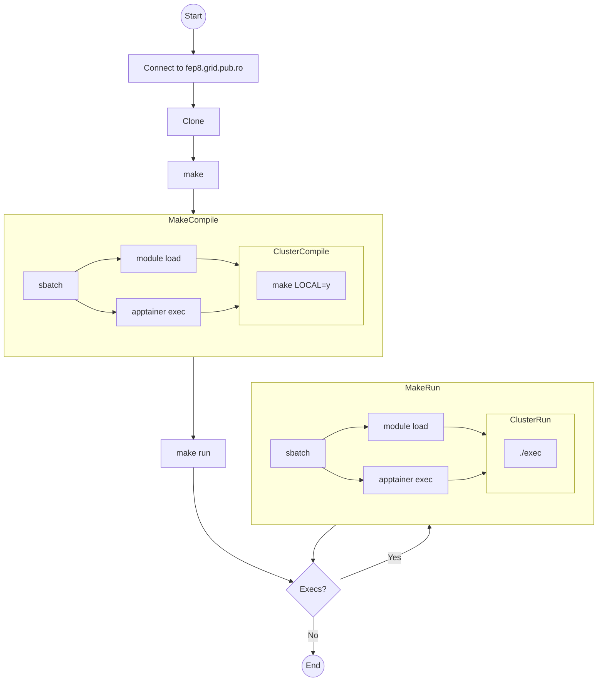

# Dezvoltarea de aplicații CUDA

## Utilizând cluster-ul

1. Conectați-vă mai întâi pe `fep8.grid.pub.ro` folosind contul de pe
  `curs.upb.ro`.
  Urmăriți următorul tutorial pentru ca să vă conectați de pe **dispozitivele
  personale** [fără parolă].
    ```bash
    $ ssh prenume.numeID@fep8.grid.pub.ro
1. Clonați acest repository.
    Observație: mențineți clona la curent cu schimbările recente (e.g. `git pull`)
    ```bash
    [prenume.numeID@fep8 ~]$ git clone https://gitlab.cs.pub.ro/asc/asc-public.git
    ```
1. Navigați către aplicația cu care lucrați.
    ```bash
    [prenume.numeID@fep8 hello]$ cd asc-public/labs/cuda/intro/tutorials/hello
    ```
1. Asigurați-vă că aveți CUDA configurat pe GPU-ul pe care lucrați.
    ```bash
    [prenume.numeID@fep8 hello]$ make run RUN_CMD="nvidia-smi"
    Submitted batch job 341504
    [prenume.numeID@fep8 hello]$ cat slurm-341504.out
    Sat Mar 30 10:44:17 2024
    +-----------------------------------------------------------------------------------------+
    | NVIDIA-SMI 550.54.15              Driver Version: 550.54.15      CUDA Version: 12.4     |
    |-----------------------------------------+------------------------+----------------------+
    | GPU  Name                 Persistence-M | Bus-Id          Disp.A | Volatile Uncorr. ECC |
    | Fan  Temp   Perf          Pwr:Usage/Cap |           Memory-Usage | GPU-Util  Compute M. |
    |                                         |                        |               MIG M. |
    |=========================================+========================+======================|
    |   0  Tesla P100-PCIE-16GB           On  |   00000000:0D:00.0 Off |                    0 |
    | N/A   25C    P0             24W /  250W |       0MiB /  16384MiB |      0%      Default |
    |                                         |                        |                  N/A |
    +-----------------------------------------+------------------------+----------------------+

    +-----------------------------------------------------------------------------------------+
    | Processes:                                                                              |
    |  GPU   GI   CI        PID   Type   Process name                              GPU Memory |
    |        ID   ID                                                               Usage      |
    |=========================================================================================|
    |  No running processes found                                                             |
    +-----------------------------------------------------------------------------------------+
    ```
1. Compilați și rulați.
    ```bash
    [prenume.numeID@fep8 hello]$ make
    Submitted batch job 339551
    [prenume.numeID@fep8 hello]$ cat slurm-339551.out
    make[1]: Entering directory `/export/home/acs/stud/m/prenume.numeID/asc-public/labs/cuda/intro/tutorials/hello'
    nvcc   hello.cu -o hello
    make[1]: Leaving directory `/export/home/acs/stud/m/prenume.numeID/asc-public/labs/cuda/intro/tutorials/hello'
    [prenume.numeID@fep8 hello]$ make run
    Submitted batch job 339559
    [prenume.numeID@fep8 hello]$ cat slurm-339559.out
    [HOST] Hello from the host!
    [HOST] You have 1 CUDA-capable GPU(s)
    [GPU] Hello from the GPU!
    [GPU] Hello from the GPU!
    [GPU] The value is 11
    [GPU] The value is 11
    [prenume.numeID@fep8 hello]$ make clean
    rm -f hello slurm-*.out slurm-*.err
    ```
    *Notă*. În caz în care fișierul `slurm-ID.out` nu a fost creat, verificați
    statusul job-ului vostru.
    ```bash
    [prenume.numeID@fep8 hello]$ squeue -j 339347
             JOBID PARTITION     NAME     USER ST       TIME  NODES NODELIST(REASON)
            339347        xl     wrap cucu.bau PD       0:00      1 (Priority)
    ```
    **Atenție**! Dacă comanda voastră necesită mai mult timp de rulare,
    veți vedea outputuri parțiale în fișierul `slurm-ID.out`. Folosiți atunci
    `watch`. (`man 1 watch`).
    ```bash
    [prenume.numeID@fep8 hello]$ watch cat slurm-339347.out
    ```
1. Ajustați parametrii de rulare din [Makefile](../Makefile) în favoarea voastră.
    ```bash
    make BUILD_TIME=00:05:00
    # sau
    make RUN_TIME=00:05:00
    ```

Opțional, s-ar putea să vă ajute să montați subdirectorul `labs` din clona
voastră a acestui repository pe mașina locală. Ajutați căile din instrucțiunile
de mai jos la nevoie.
```bash
[prenume.numeID@fep8 labs]$ pwd
/export/home/acs/stud/m/matei.barbu1905/asc-public/labs
[prenume.numeID@fep8 labs]$ exit
# local machine commands from now on
$ mkdir fep-local-mnt-point
$ sudo sshfs prenume.numeID@fep8.grid.pub.ro:/export/home/acs/stud/m/prenume.numeID/asc-public/labs fep-local-mnt-point -o follow_symlinks,allow_other
```

### În spatele cortinei

Urmăriți diagrama de mai jos pentru a înțelege care este șirul de acțiuni
executate în spatele exemplului de mai sus.


## Utilizând procesorul grafic personal

Urmăriți instrucțiunile pe o mașină UNIX-like. Vedeți instrucțiunile de instalare
pentru [Linux](https://docs.nvidia.com/cuda/cuda-installation-guide-linux/). În
cazul în care folosiți MacOS sau Windows vă rugăm să creați un merge request cu
pașii pe care i-ați urmat.

### Linux

1. Clonați acest repository.
    Observație: mențineți clona la curent cu schimbările recente (e.g. `git pull`)
    ```bash
    $ git clone https://gitlab.cs.pub.ro/asc/asc-public.git
    ```
2. Navigați către aplicația cu care lucrați.
    ```bash
    $ cd asc-public/labs/cuda/intro/tutorials/hello
    ```
3. Compilați sursele.
    ```bash
    $ make LOCAL=y
    nvcc   hello.cu -o hello
    $ ./hello
    [HOST] Hello from the host!
    [HOST] You have 1 CUDA-capable GPU(s)
    [GPU] Hello from the GPU!
    [GPU] Hello from the GPU!
    [GPU] The value is 11
    [GPU] The value is 11
    ```
    **Observație**! Dacă întâmpinați următoarea problemă:

    > ERROR: No supported gcc/g++ host compiler found, but clang-14 is available.
    > Use 'nvcc -ccbin clang-14' to use that instead.

    Rulați așă comanda de `make`:
    ```bash
    make NVCC="nvcc -ccbin clang-14" LOCAL=y
    ```

## Aplicații

0. Rulați exemplele din [tutorials](tutorials/) conform pașilor de mai sus.
1. Rezolvați problemele din [exercises](exercises/) urmărind `TODO`-urile.
  Acestea sunt (în ordine ascendentă a dificultății):
    1. [vector-addition](exercises/vector-addition/)
    2. [indices](exercises/indices/)
    3. [swap](exercises/swap/)
    

[fără parolă]: https://askubuntu.com/questions/46930/how-can-i-set-up-password-less-ssh-login
